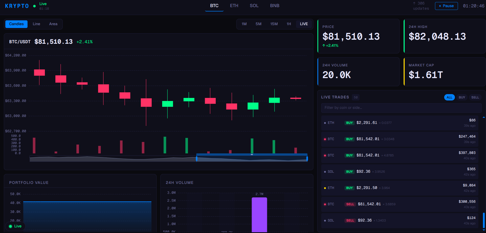

# Krypto Terminal — HNG Stage 5A

A real-time crypto trading terminal dashboard built with Vue 3, Pinia, and ECharts. Streams live price data from Binance public WebSocket feeds and presents it in a Bloomberg-style dark interface with candlestick charts, volume analysis, trade activity feed, and connection health monitoring.

---

## Screenshot

> _Dashboard running with live BTC/USDT candlestick data, metric cards, and activity feed._



---

## Setup Instructions

**Prerequisites:** Node.js 20+ and npm.

```bash
# Clone the repository
git clone <repo-url>
cd krypto

# Install dependencies
npm install

# Start development server
npm run dev

# Production build
npm run build
```

**No API keys required.** The app connects to Binance's public combined WebSocket stream (`wss://stream.binance.com:9443`) which requires no authentication. If the WebSocket is blocked (firewall, region, etc.), the app automatically falls back to a mock data generator after 5 failed reconnection attempts.

---

## Architecture

### Folder Structure

```
src/
├── assets/          Global CSS, Tailwind theme tokens
├── components/
│   ├── charts/      ECharts wrappers (Candlestick, Line, Area, Bar)
│   ├── layout/      DashboardHeader, ErrorBoundary, DashboardSidebar
│   └── widgets/     MetricCard, ActivityFeed, StreamStatus badge
├── composables/
│   ├── useDataStream.ts   WebSocket engine + reconnect + mock fallback
│   └── useThrottle.ts     Throttle, debounce, RAF, FIFO buffer utils
├── router/          Vue Router — single route to DashboardView
├── stores/
│   ├── useMarketStore.ts  All price/candle/trade data
│   └── useStreamStore.ts  Connection status, uptime, retry count
├── types/           market.types.ts — all shared TypeScript interfaces
├── utils/
│   ├── dataGenerator.ts   Mock OHLCV + ticker + trade event factories
│   └── formatters.ts      Price, volume, timestamp, color formatters
└── views/
    └── DashboardView.vue  Root layout — assembles all components
```

### Component Hierarchy

```
App.vue
└── DashboardView.vue
    ├── DashboardHeader.vue          (coin selector, stream status, clock)
    ├── ErrorBoundary.vue
    │   └── [chart panel]
    │       ├── CandlestickChart.vue
    │       ├── LineChart.vue
    │       └── AreaChart.vue
    ├── MetricCard.vue ×4            (price, high, volume, market cap)
    ├── ActivityFeed.vue             (live trade event list)
    ├── AreaChart.vue                (portfolio history)
    ├── BarChart.vue                 (24h volume comparison)
    └── StreamStatus.vue             (fixed badge, connection health)
```

### Data Flow

```
Binance WebSocket
       │
       ▼
useDataStream (composable)
  • Parses BinanceTickerMessage → CoinTicker
  • Validates all fields; drops malformed frames silently
  • Exponential backoff on failure → mock fallback at attempt 6
       │
       ▼ (per-symbol watch in DashboardView)
useMarketStore (Pinia)
  • updateTicker() → advances candlestick series, updates portfolio history
  • addTradeEvent() ← 30% chance on each ticker update
       │
       ▼
Components (read-only computed props)
  • Charts receive CandlestickPoint[] or TimeSeriesPoint[]
  • MetricCards receive pre-formatted strings
  • ActivityFeed reads recentTrades computed slice
```

---

## State Management Strategy

**Why Pinia:** Setup-store syntax matches Composition API conventions already used throughout the project, making stores feel like composables. It also provides better TypeScript inference than Vuex and has a smaller bundle footprint.

**Two-store separation:**

| Store | Responsibility |
|---|---|
| `useMarketStore` | All market data — tickers, candles, portfolio history, trade events, active coin selection |
| `useStreamStore` | Connection state only — status, retry count, uptime, error details, pause flag |

This split keeps concerns clean: components displaying price data never touch connection state, and the stream composable can update `streamStore` without caring about market data shape.

**Store communication:** `DashboardView` is the single bridge. It owns the `useDataStream` composable and wires its output to both stores via `watch`. No store imports another store directly — avoids circular dependency and keeps each store testable in isolation.

---

## Rendering Optimization Decisions

**`animation: false` on real-time charts**
ECharts runs an enter animation on every `option` change by default. At 1-second update intervals, this creates continuous visual noise. Disabled on `LineChart`, `CandlestickChart`, and `AreaChart`. `BarChart` retains a 300ms animation since it updates on user interaction, not on the tick loop.

**`v-memo` on ActivityFeed rows**
Each trade row is keyed by `trade.id` and wrapped in `v-memo="[trade.id]"`. Since trade objects are immutable once created, Vue skips the entire subtree diff for existing rows on each new trade arrival.

**Computed ECharts options**
All chart `option` objects are `computed` refs. Vue's dependency tracking ensures the option only rebuilds when the specific data prop changes — unrelated reactive state (e.g., active coin switching) does not trigger a chart redraw.

**FIFO buffer on pause/resume**
When the stream is paused, incoming tickers queue into a 50-item capped array (oldest dropped when full). On resume, the buffer flushes synchronously before resuming live updates — no data is lost within the window, and there's no backpressure on the WebSocket.

**RAF throttle utility**
`useRafThrottle` wraps any function to execute at most once per animation frame using a `rafId` guard. Available for high-frequency DOM writes; prevents frame-budget overruns when multiple rapid state changes arrive in the same tick.

---

## Data Streaming Approach

**WebSocket URL:**
```
wss://stream.binance.com:9443/stream?streams=btcusdt@ticker/ethusdt@ticker/solusdt@ticker/bnbusdt@ticker
```
Binance combined stream delivers all four 24hr ticker updates over a single connection.

**Message parsing:**
Each frame is JSON-parsed inside a `try/catch`. The inner `data` field is validated for nine required keys (`e, s, c, p, P, h, l, v, q`). Price (`c`) is the critical field — if it parses to `NaN`, the entire frame is dropped. All other numeric fields fall back to the previous ticker's value via a `safe(val, fallback)` helper.

**Reconnection strategy:**
```
Attempt 1 → wait 1s
Attempt 2 → wait 2s
Attempt 3 → wait 4s
Attempt 4 → wait 8s
Attempt 5 → wait 16s  (capped at 30s)
Attempt 6 → switch to mock fallback
```
`onerror` sets state but does not schedule a reconnect — `onclose` always fires after `onerror` and owns the retry logic. Intentional `disconnect()` calls set `status = 'disconnected'` before closing, which the `onclose` handler checks to avoid spurious reconnects.

**Mock fallback:**
Seeded with `generateCandlestickSeed(symbol, 10)` per coin for realistic starting prices. Each 1s interval tick calls `generateNextCandle(prev)` to advance prices via a bounded random walk (max ±0.3% per step) — prices never reset to base values mid-session.

**Pause/resume:**
Pause keeps the WebSocket alive. Incoming tickers accumulate in a 50-item FIFO buffer. Resume flushes the buffer in arrival order then resumes live writes.

---

## Trade-offs Made

**ECharts over D3**
D3 gives full control but requires building chart primitives from scratch. ECharts provides production-quality candlestick, line, bar, and area series with DataZoom and crosshair tooltips out of the box. At the update frequency this terminal requires, ECharts' batched render pipeline outperforms a hand-rolled D3 implementation.

**Mocked trade events**
Binance's individual trade stream (`@trade`) requires a separate WebSocket connection per symbol — four additional connections for four coins. Instead, a 30% random chance on each ticker update generates a synthetic trade event via `generateTradeEvent`. The trade distribution is realistic enough for UI demonstration purposes.

**Canvas renderer over SVG**
`CanvasRenderer` is registered instead of `SVGRenderer`. At 1-second update intervals across multiple charts, Canvas avoids the DOM node overhead that SVG accumulates with every data point. SVG would be preferable only if accessibility or print output were requirements.

**No virtual scrolling on ActivityFeed**
The trade list is capped at 50 rendered rows and 100 stored events. At this scale, a windowed virtual list adds complexity with no measurable performance benefit. Rows use `v-memo` to skip diffing, which is sufficient.

---

## Features Implemented

- [x] Live price streaming via Binance public WebSocket
- [x] Four trading pairs: BTC/USDT, ETH/USDT, SOL/USDT, BNB/USDT
- [x] Candlestick chart with volume overlay and DataZoom
- [x] Line chart (close price over time)
- [x] Area chart (portfolio value history + multi-series support)
- [x] Bar chart (24h volume comparison across pairs)
- [x] Chart type switcher: Candlestick | Line | Area
- [x] Time range filter: 1m | 5m | 15m | 1h | Live
- [x] Four metric cards: Price, 24h High, 24h Volume, Market Cap
- [x] Loading skeleton shimmer on metric cards
- [x] Real-time activity feed with trade severity indicators
- [x] Feed filterable by coin and BUY/SELL side
- [x] Stream status badge with animated pulse indicator
- [x] Error tooltip on connection failure
- [x] Exponential backoff reconnection (up to 5 attempts)
- [x] Automatic mock fallback after reconnection exhausted
- [x] Pause/resume with 50-item buffering
- [x] Connection uptime counter (MM:SS)
- [x] Live clock (HH:MM:SS)
- [x] Responsive layout: two-column on xl, stacked on tablet/mobile
- [x] Error boundary around chart panel
- [x] Full TypeScript — zero `any` types
- [x] Tree-shaken ECharts imports (no full bundle)
